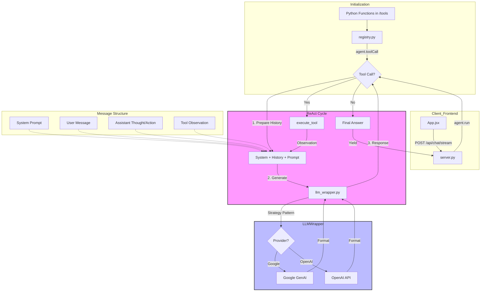

# Project Architecture: Agent From Scratch

This diagram visualizes how the system handles tool registration, agent execution, and LLM provider abstraction.

## Component Breakdown

### 1. Tool Registration (`registry.py`)
Tools are defined as standard Python functions. They are registered using the `agent.toolCall(schema)` decorator/method, which adds their metadata to `agent.tool_definition`. This definition is what the LLM "sees" to know what tools are available.

### 2. The Agent Loop (`agent.py`)
The `Agent.run` method implements a **ReAct (Reasoning and Acting)** loop:
1.  **Preparation**: Combines the system prompt and history into a single payload.
2.  **Generation**: Sends the payload to the LLM.
3.  **Analysis**: If the LLM returns a `function_call`, the agent pauses, executes the Python code, appends the **Observation** to history, and repeats.
4.  **Completion**: If no tool call is requested, it yields the text and stops.

### 3. LLM Provider Abstraction (`llm_wrapper.py`)
The `LLMWrapper` uses a **Strategy Pattern**. It converts our internal message format into the specific format required by the provider (e.g., Gemini's `Content` objects vs OpenAI's `Message` dicts). This allows us to swap models without changing the core Agent logic.

### 4. Communication (`server.py`)
The server acts as a bridge, streaming events from the agent to the frontend using **Server-Sent Events (SSE)**. This allows the UI to update in real-time as the agent "thinks" or "acts".
