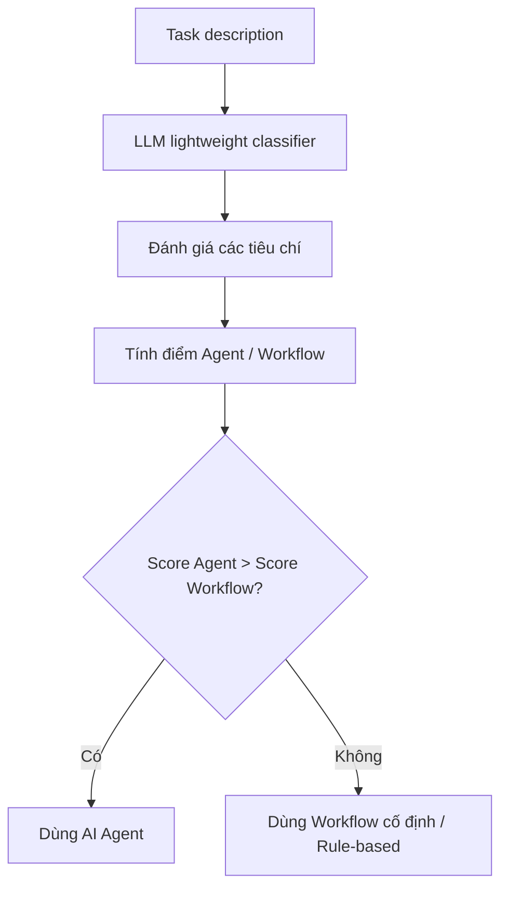

# AI Agent — Learning Summary

Tổng hợp kiến thức và kinh nghiệm thu được qua các giai đoạn nghiên cứu và xây dựng AI Agent từ đầu.

## Mục lục

1. [Khái niệm AI Agent](#1-khái-niệm-ai-agent)
2. [Tool Use / Function Calling](#2-tool-use--function-calling)
3. [Project agent_from_scratch — Implementation Overview](#3-project-agent_from_scratch--implementation-overview)
4. [So sánh các Framework AI Orchestration](#4-so-sánh-các-framework-ai-orchestration)

---

## 1. Khái niệm AI Agent

### Định nghĩa

AI Agents là các hệ thống trong đó LLM tự động điều phối và quản lý tiến trình xử lý, đồng thời sử dụng các công cụ sẵn có để hoàn thành nhiệm vụ do người dùng giao.

- **Ưu điểm**: Tự chủ ra quyết định thực hiện các tools, có khả năng thích nghi khi context thay đổi.
- **Hạn chế**: Khó khăn trong việc quyết định đường đi để dẫn đến kết quả nếu khả năng suy luận không tốt.

### Agents vs RAG / Chatbot / Workflow

| System | Mục đích sử dụng | Tính năng đặc trưng |
|---|---|---|
| Agents | Tự động thực hiện các nhiệm vụ để đạt mục tiêu được giao | LLMs nắm quyền quyết định tools và sử dụng chúng để đạt được kết quả |
| RAG | Cải thiện trả lời các câu hỏi dựa vào tri thức sẵn có bằng LLM | Lấy các đoạn chunks liên quan từ Documents để tạo câu trả lời dựa vào LLMs |
| Chatbot | Trò chuyện với người dùng | Sử dụng LLMs để tương tác với người dùng dựa trên các câu hỏi được thiết lập sẵn hoặc câu hỏi mới |
| Workflow | Tự động hóa một quy trình để đạt kết quả cuối cùng | LLMs chỉ đóng vai trò là người tổng hợp kết quả và trả về kết quả cuối |

### Agent Loop (pseudocode)

```
Input: user's prompt Q
Available tools T
State S <- initialize with Q

While not done:
    thought      <- Reason(S, T)
    action       <- SelectTool(thought, T)
    observation  <- Execute(action)
    S            <- UpdateState(S, thought, action, observation)

    if Validate(S):
        return FinalAnswer(S)
```

### 4 Thành phần chính: LLM / Memory / Tools / Planning

**LLM**: chương trình AI có khả năng nhận diện và tạo văn bản. Được huấn luyện trên dữ liệu văn bản lớn để học cách biểu diễn và sinh ngôn ngữ. Đóng vai trò "bộ não" trong AI Agent / RAG / Workflow / Chatbot.

**Memory**: 2 loại:

- **Short-term memory** — bộ nhớ ngắn hạn của agent, lưu ngữ cảnh gần đây và trạng thái tạm thời của phiên hiện tại. Giúp duy trì sự liên tục trong suy luận và ra quyết định trong các tác vụ nhiều bước hoặc hội thoại nhiều lượt. Thường lưu trong RAM, cache, hoặc database tùy backend.
- **Long-term memory** — bộ nhớ dài hạn, lưu thông tin có thể tái sử dụng qua nhiều phiên hoặc dài hạn. Giúp duy trì tri thức, cá nhân hóa trải nghiệm. Thường lưu trong database, vector database tùy kiến trúc.

**Tools**: các function/API mà agent có thể gọi để tương tác với thế giới bên ngoài. Tools mở rộng năng lực của LLM ra ngoài phạm vi text generation thuần.

**Planning**: khả năng phân chia task phức tạp thành các bước nhỏ và sắp xếp thứ tự thực hiện. Có thể implicit (ReAct) hoặc explicit (planner agent + executor agent).

### Khi nào dùng agent, khi nào không cần

- Nếu rule-based hoặc workflow xử lý tốt 95% case → **không cần agent**
- Nếu task phức tạp, cần nhiều nhánh, nhiều bước → **dùng agent**

Để tổng quát hóa, có thể dùng **LLM lightweight classifier** chấm điểm theo tiêu chí:
- Mức độ rõ ràng của quy tắc
- Mức độ mơ hồ của đầu vào
- Nhu cầu suy luận nhiều bước
- Độ nhạy về chi phí và độ trễ
- Nhu cầu sử dụng các tools
- Khả năng kiểm chứng đầu ra



---

## 2. Tool Use / Function Calling

### Tool Use với Claude

- Tool use cho phép Claude gọi những hàm mà người dùng định nghĩa trước hoặc các hàm có sẵn của Anthropic.
- Claude quyết định khi nào gọi tool dựa vào yêu cầu người dùng và mô tả tool.
- Cuối cùng trả về **structured call** để ứng dụng người dùng thực thi (client tools) hoặc Anthropic thực thi (server tools).

#### Client tools

Tool được thực thi ở phía ứng dụng. Claude chỉ tạo yêu cầu gọi tool có cấu trúc (tên tool + input). Ứng dụng tự chạy hàm tương ứng và gửi lại `tool_result`.

**Khi nào dùng:**
- Truy cập hệ thống nội bộ
- Database/API riêng
- Local files hoặc shell commands
- Capability chỉ tồn tại trong môi trường người dùng

**Ưu điểm:** Kiểm soát runtime, chủ động về quyền truy cập, dễ quản lý logging/timeout/bảo mật.

#### Server tools

Tool được thực thi trên hạ tầng Anthropic. Người dùng không cần tự chạy tool — Anthropic đảm nhận và trả kết quả về cho Claude.

**Khi nào dùng:**
- Muốn dùng khả năng được Anthropic quản lý sẵn
- Giảm orchestration code phía ứng dụng
- Cần các tool do Anthropic cung cấp trực tiếp (ví dụ search/exec)

**Ưu điểm:** Tích hợp đơn giản, ít quản lý execution flow.
**Hạn chế:** Ít quyền kiểm soát runtime.

### Function Calling với OpenAI

Function calling cho phép model OpenAI tạo lời gọi hàm có cấu trúc. Trong Responses API, người dùng truyền `tools` vào request; model có thể chọn gọi function tools, ứng dụng chạy code tương ứng và gửi kết quả trở lại model.

OpenAI có 2 nhóm tools:
- **Function tools** — người dùng tự định nghĩa schema và implementation
- **Built-in tools** — OpenAI cung cấp sẵn (web search, file search, code interpreter, image generation, computer use, remote MCP servers, tool search)

#### Cơ chế hoạt động

1. Ứng dụng gửi request lên model kèm danh sách `tools`
2. Model trả về tool call
3. Ứng dụng thực thi code tương ứng
4. Ứng dụng gửi tool output trở lại model
5. Model trả về câu trả lời cuối hoặc gọi thêm tool nếu cần

### Chi phí Tool Call

#### Tool use được tính tiền theo gì

3 thành phần chính:
- **Input tokens** — toàn bộ token gửi lên model, bao gồm cả `tools` parameter
- **Output tokens** — số token model sinh ra
- **Server-side tool usage** — phí usage-based riêng cho server tools (ví dụ `web_search` tính theo số lần search)

#### Token phát sinh khi tool_use = True

- **`tools` parameter**: tên tool, mô tả, schema
- **`tool_use` content blocks**: khi model trả về yêu cầu gọi tool
- **`tool_result` content blocks**: khi ứng dụng gửi kết quả trở lại

### Định nghĩa Tools

#### JSON Schema

Bản mô tả cấu trúc input mà tool chấp nhận. LLM nhìn schema để hiểu cách điền input phù hợp.

#### Tool Description

Phần giải thích bằng ngôn ngữ tự nhiên để model hiểu mục đích tool.

#### Cách LLM chọn tools

LLM gom **Prompt + Danh sách tools + Tool Description + JSON Schema** để dự đoán tool sẽ dùng.

Ví dụ prompt "Thời tiết Sài Gòn" → model trả về:

```json
{
  "type": "tool_use",
  "name": "get_weather",
  "input": {
    "city": "HoChiMinh"
  }
}
```

#### Cách tools được đưa vào LLM

Dưới dạng metadata có cấu trúc gồm `messages` + `tool definitions`:

```json
{
  "messages": [
    {"role": "user", "content": "Thời tiết ở Sài Gòn hôm nay thế nào?"}
  ],
  "tools": [
    {
      "name": "get_weather",
      "description": "Get current weather by city",
      "input_schema": {
        "type": "object",
        "properties": {"city": {"type": "string"}},
        "required": ["city"]
      }
    }
  ]
}
```

### Demo cách LLM chọn tools

1. **Prompt single-tool**: "What is the weather in Ho Chi Minh City today?" → chọn 1 tool `get_weather`
2. **Prompt multi-tool**: "For my trip planning, do all three tasks: get the current weather in Ho Chi Minh City, get general climate information for Bangkok, and search the web for recent travel advisories for Thailand." → chọn nhiều tools (`get_weather`, climate info, web search)

---

## 3. Project agent_from_scratch — Implementation Overview

Project được build "from scratch" để hiểu **bản chất** của AI Agent trước khi adopt một framework cao cấp như LangGraph. Tất cả khái niệm trong section 1 và 2 đều được implement bằng Python + React thuần — không dùng LangChain/LangGraph/CrewAI.

### Mục đích

- Hiểu cơ chế ReAct loop bằng cách tự code, không che bởi abstraction của framework
- Hiểu cách LLM provider trả về function call và cách parse/route nó
- Hiểu trade-off giữa stateless và stateful backend
- Hiểu touch points của session persistence (load → run → save → list)

### Kiến trúc 3 tầng

```
┌─────────────────────────────────────────────────────────┐
│ Frontend (React + Vite)                                 │
│  - Chat UI, sidebar sessions, file upload, quota panel  │
│  - localStorage giữ user_id (UUID)                      │
└────────────────────┬────────────────────────────────────┘
                     │ HTTP + SSE
┌────────────────────▼────────────────────────────────────┐
│ Backend (FastAPI)                                       │
│  - server.py — endpoints + session/usage tracking       │
│  - agent.py — ReAct loop (generator)                    │
│  - llm_wrapper.py — provider strategy (Gemini/OpenAI)   │
│  - tools/ — calculate, weather, process_file, list_files│
│  - db.py — Redis SessionStore                           │
└────────────────────┬────────────────────────────────────┘
                     │
                     ▼
              Redis (Docker local
              hoặc Redis Cloud)
```

### Notable Features

#### 1. Provider abstraction qua Strategy Pattern

`LLMWrapper` là facade trên 2 provider:

```python
class LLMWrapper:
    def __init__(self, provider="gemini" | "openai"):
        if provider == "gemini":
            self.provider = GeminiProvider(...)
        else:
            self.provider = OpenAIProvider(...)
```

2 provider dùng **internal content type khác nhau**:
- Gemini: `google.genai.types.Content / Part` native
- OpenAI: dataclass tự định nghĩa (`SimpleContent`, `SimplePart`, `SimpleFunctionCall`, `SimpleFunctionResponse`), sau đó flatten thành OpenAI message dict

→ Agent loop chỉ làm việc với wrapper interface — không biết provider nào ở dưới. Khi muốn thêm provider thứ 3 (Anthropic chẳng hạn), chỉ cần implement `LLMProvider` interface.

#### 2. ReAct Loop dạng Generator

`Agent.run()` là Python generator yield 4 loại event:

```python
def run(self, prompt, history=None, max_steps=5):
    contents = [...build initial...]
    turn_usage = TokenUsage()

    for _ in range(max_steps):
        response = self.client.generate(contents, tool_definitions)
        contents.append(response.content)

        # Tích lũy usage
        if response.usage:
            turn_usage.prompt_tokens     += response.usage.prompt_tokens
            turn_usage.completion_tokens += response.usage.completion_tokens

        yield {'type': 'model', 'content': response.content}

        if not response.function_calls:
            yield {'type': 'done', 'history': contents, 'usage': turn_usage}
            return

        for fc in response.function_calls:
            yield {'type': 'tool_call',   'name': fc.name, 'args': fc.args}
            result = self.execute_tool(fc)
            yield {'type': 'tool_result', 'name': fc.name, 'result': result}
            ...append tool response to contents...

    yield {'type': 'done', 'history': contents, 'usage': turn_usage}
```

→ Generator design giúp `server.py` stream từng event ra SSE thay vì đợi cả loop xong. UX feel "real-time" như ChatGPT.

#### 3. Tool Registration qua Decorator + Pydantic

```python
CalculatorInput = create_model('CalculatorInput',
    expression=(str, Field(..., description="A math expression"))
)

@agent.toolCall(args_schema=CalculatorInput)
def calculate(expression: str) -> dict:
    """Calculate a basic math expression."""
    ...
```

Decorator tự động:
- Lấy tên function làm tool name
- Lấy docstring làm description (LLM đọc cái này để biết mục đích tool)
- Convert `args_schema.model_json_schema()` thành JSON Schema gửi cho LLM

→ Thêm tool mới = viết function + Pydantic schema + 1 dòng decorator. Không động vào agent core.

#### 4. Custom Safe Calculator (no eval)

`tools/calculator.py` implement **lexer + recursive descent parser** thuần:

```
Lexer: text → tokens (NUMBER, PLUS, MINUS, MUL, DIV, LPAREN, RPAREN, EOF)
Parser:
    expression = term ((+ | -) term)*
    term       = factor ((* | /) factor)*
    factor     = NUMBER | "(" expression ")"
```

→ Hoàn toàn không dùng `eval()` — an toàn trước code injection. Trade-off: chỉ support `+`, `-`, `*`, `/`, `()`. Không có function/biến.

#### 5. SSE Streaming Endpoint

`POST /api/chat/stream` trả `text/event-stream`:

```python
async def chat_stream(...):
    async def generate():
        for event in agent.run(...):
            if event['type'] == 'model':
                yield f"data: {json.dumps({'type':'model', 'content': serialized})}\n\n"
            elif event['type'] == 'done':
                ...persist session, record usage...
                yield f"data: {json.dumps(payload)}\n\n"
            else:  # tool_call, tool_result
                yield f"data: {json.dumps(event)}\n\n"
    return StreamingResponse(generate(), media_type="text/event-stream")
```

Frontend parse SSE bằng `ReadableStream + TextDecoder`, update UI theo từng event.

#### 6. Token Usage Monitoring (per-user, per-day)

`UsageTracker` in-memory dict keyed bởi `(user_id, date_iso)`:

```python
class UsageTracker:
    def __init__(self):
        self._data = defaultdict(lambda: {"prompt_tokens":0, "completion_tokens":0, "requests":0})

    def record(self, user_id, usage):
        key = (user_id, date.today().isoformat())
        self._data[key]["prompt_tokens"]     += usage.prompt_tokens
        self._data[key]["completion_tokens"] += usage.completion_tokens
        self._data[key]["requests"]          += 1
```

- Frontend gửi `X-User-Id` header (UUID lưu localStorage)
- Backend đọc từng `model` event → cộng dồn token cho user/day
- `done` event chứa `usage` (per-turn) — frontend tự fetch `/api/usage` để update daily quota panel

#### 7. Session Storage với Redis

Schema:
```
session:{session_id}    → STRING (JSON {messages, title, user_id, timestamps})  TTL 30 ngày
user_sessions:{user_id} → ZSET (member: session_id, score: updated_at)
```

- 1 user có **nhiều session** (multi-conversation như ChatGPT sidebar)
- ZSET là index để liệt kê session sorted-by-recency mà không scan toàn DB
- Chat endpoints nhận `X-Session-Id` header — nếu có, load history từ Redis; nếu không, stateless backward-compatible
- **Auto-titling**: lần đầu session có message, backend lấy first user message làm title (strip `[Attached File:...]` markers, truncate 50 chars)

#### 8. Frontend State Model

```
localStorage:
  agent_user_id  → UUID (sinh 1 lần, dùng cả đời browser)

React state (App.jsx):
  userId, currentSessionId, sessions[], messages[]

API headers (mọi request):
  X-User-Id    → từ localStorage
  X-Session-Id → khi gọi chat endpoints
```

UI sidebar có:
- **+ New Chat** button → POST `/api/sessions`, switch
- Session list (sorted newest-first) → click để switch
- Per-session **×** delete button (hover-revealed)

#### 9. Test Coverage

65+ tests trong `unittest/`:

| File | Tests | Approach |
|---|---|---|
| `test_calculator.py` | 9 | Direct unit tests trên lexer/parser |
| `test_history.py` | 2 | Mock LLM client, kiểm tra reconstruct |
| `test_usage.py` | 14 | Direct UsageTracker + mock OpenAI provider + TestClient HTTP tests |
| `test_db.py` | 22 | **fakeredis** in-memory drop-in cho Redis |
| `test_chat_sessions.py` | 12 | TestClient + fakeredis, mock agent.run, kiểm tra session integration end-to-end |

→ Toàn bộ test chạy trong **<2 giây**, không cần Redis thật, không cần API key thật.

### Lessons Learned

#### Khái niệm

- **ReAct = Reasoning + Acting** — concrete implementation đơn giản hơn nhiều so với hình dung từ paper. Chỉ là while loop: model call → parse → tool call → observation → repeat.
- **Streaming != streaming text** — agent có thể stream **events** (model thinking → tool call → tool result → final). Mỗi event có giá trị riêng cho UX.
- **Stateless backend đơn giản hóa code rất nhiều**, nhưng đến lúc cần multi-device/persistence thì **frontend-owned history** không scale được.
- **Provider differences là thật** — Gemini Content/Part vs OpenAI message dict không phải khác biệt cosmetic. Wrapper layer phải xử lý 2 internal type khác nhau, không chỉ 2 endpoint.

#### Kỹ thuật

- **Pydantic schema → JSON Schema** là cây cầu gọn nhất giữa Python type và những gì LLM "thấy".
- **Generator yield pattern** rất phù hợp cho SSE streaming — không cần callback hoặc async complexity.
- **Decorator-based registration** giảm boilerplate khi thêm tool mới — tốt hơn config dict tay.
- **Schema design cho Redis = data key + index ZSET** — pattern denormalization cơ bản. ZSET đặc biệt mạnh cho "list newest N của user X".
- **fakeredis** là vũ khí test mạnh — implement đầy đủ Redis API in-memory, drop-in replacement cho `redis.Redis`. Test Redis code mà không cần Redis thật.
- **Auto-title server-side** cleaner hơn frontend PATCH thêm round-trip — backend có sẵn data, frontend không cần biết logic.

#### Bảo mật

- **Pickle deserialization = RCE primitive** — `pickle.loads(untrusted_bytes)` ≡ `exec(untrusted_code)`. JSON an toàn vì format không có cú pháp encode "call function".
- **JsonPlusSerializer (LangGraph default)** an toàn nhờ 3 lớp: format không expressable, parser passive, app-layer whitelist các type được phép reconstruct.
- **API key/password leak qua chat hoặc git commit** rất nguy hiểm — phải rotate ngay khi phát hiện.
- **TLS in-transit (`rediss://`)** bắt buộc cho production qua Internet. `redis://` chỉ OK cho localhost.

#### Workflow

- **Local Redis (Docker hoặc Memurai) cho dev, Redis Cloud cho prod** — pattern phổ biến nhất. Code không đổi, chỉ swap `REDIS_URL`.
- **Corporate firewall thường chặn outbound port lạ** — nếu Redis Cloud timeout, suspect firewall trước khi nghi sai password.
- **Test framework choice**: stdlib `unittest` (vs pytest) tận dụng được khi project nhỏ. fakeredis + TestClient của FastAPI cho phép test integration hoàn chỉnh không cần infra.

---

## 4. So sánh các Framework AI Orchestration

### Bảng so sánh

| Framework | Core Idea | Strength | Best Use Case |
|---|---|---|---|
| **LangGraph** | Stateful graph (StateGraph), node = agent/task, explicit control flow | Kiểm soát flow chi tiết, state minh bạch, checkpoint/persistence, hỗ trợ loop/retry & human-in-the-loop, debug tốt | Workflow phức tạp, cần reliability cao, production system |
| **Microsoft Agent Framework** (AutoGen + Semantic Kernel) | Multi-agent distributed system (actor model) + enterprise integration | Agent giao tiếp qua conversation (AutoGen), planning + memory + plugin (Semantic Kernel), async & distributed, phù hợp enterprise | Hệ multi-agent lớn, enterprise (Azure/.NET), cần scale & integration |
| **CrewAI** | Role-based collaboration (agent như team member với role/goal/backstory) | Dễ dùng, build nhanh, hỗ trợ workflow tuần tự & phân cấp, có sẵn tool (web/API/file) | Prototype nhanh, demo, business workflow đơn giản |
| **Pydantic AI** | Type-safe agent system (data validation-first) | Validate input/output chặt, giảm lỗi runtime, hỗ trợ MCP/A2A, durable execution, observability | System cần reliability cao, strict schema, production backend |
| **Anthropic Agent SDK** | Managed agent runtime (Claude-native) | Computer use, sandboxing, session persistence, infra managed hoàn toàn | Automation agent dùng Claude, không muốn tự quản infra |
| **Google ADK** | Cloud-native agent framework (Vertex AI + multimodal + A2A) | Tích hợp Gemini, hỗ trợ multimodal (text/image/audio/video), observability mạnh, scale tốt trong Google Cloud | Enterprise system trên Google Cloud, multimodal AI |
| **LlamaIndex Workflows** | Event-driven agent system + data-centric (RAG-first) | Kết nối data mạnh (DB, docs), event-based async flow, parallel execution, retry, observability reasoning | RAG system phức tạp, knowledge assistant, data-heavy AI |

### Đề xuất Framework

#### 1. Ưu tiên tính ổn định, quy trình phức tạp, chất lượng code

**Lựa chọn**: **LangGraph + Pydantic AI**

**Lý do**: Đây là "cặp bài trùng" cho production system cần độ tin cậy cao.
- **LangGraph**: kiểm soát tuyệt đối luồng trạng thái (State Management) qua sơ đồ Graph minh bạch, hỗ trợ Human-in-the-loop cực tốt.
- **Pydantic AI**: tận dụng validate dữ liệu type-safe chặt chẽ cho LLM input/output → giảm lỗi runtime, code sạch, dễ bảo trì.

#### 2. Bài toán tập trung vào dữ liệu (Advanced RAG & Knowledge Assistant)

**Lựa chọn**: **LlamaIndex Workflows**

**Lý do**: Cho hệ thống xử lý khối lượng tài liệu doanh nghiệp lớn:
- **Event-driven (hướng sự kiện)**: cho phép xây dựng async flow cực linh hoạt
- **Parallel execution**: tăng tốc truy xuất dữ liệu từ nhiều nguồn (Vector DB, SQL, API) cùng lúc
- **Observability + Evaluation chuyên sâu cho RAG**: kiểm soát độ chính xác câu trả lời dựa trên dữ liệu thực tế, không chỉ suy luận của model

### Kết nối với agent_from_scratch

Sau khi build thủ công, mapping ngược lại các framework:

| Khái niệm tự build | Tương đương LangGraph |
|---|---|
| `Agent.run()` generator loop | StateGraph với START → agent_node → tool_node → END |
| `tool_registry` dict | ToolNode với danh sách tool |
| `messages: list[dict]` history | `MessagesState` (built-in) |
| `LLMWrapper` strategy | `init_chat_model()` với provider arg |
| `SessionStore` Redis | `RedisSaver` checkpointer |
| `serialize_content` / `reconstruct_content` | `JsonPlusSerializer` (built-in) |
| `_persist_session_history` auto-title | Custom node hoặc post-hook |

→ Việc tự build trước giúp **hiểu trade-off** mà framework đang đưa ra. Khi migrate sang LangGraph, không phải "magic" — chỉ là refactor pattern đã hiểu sang abstraction sẵn có.
