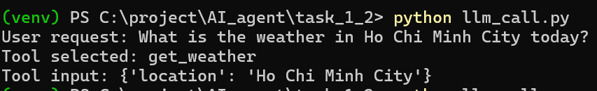
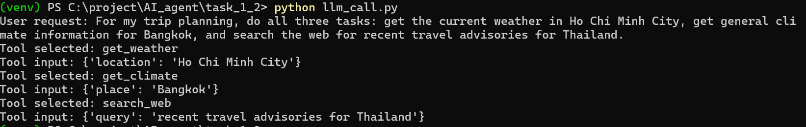

# Task 1.2 — Tool Use / Function Calling 
- Đọc Anthropic tool use docs + OpenAI function calling
- Hiểu JSON schema, tool description best practices
- Lab: test cách LLM chọn tool (3–5 prompt khác nhau)
- Note: Chi tiết cách tool được đưa vào llm, chi phí tool call

## Tool use and Function calling
### Tool use with Claude: 
- Tool use cho phép Claude gọi những hàm mà người dùng định nghĩa trước hoặc các hàm có sẵn của Anthropic.
- Claude quyết định khi nào gọi tool dựa vào yêu cầu người dùng và mô tả của những tools đó.
- Cuối cùng, trả về **structured call** để ứng dụng người dùng thực thi nó (client tools) hoặc Anthropic thực thi (server tools).

#### Tools

Trong tool use của Claude có 2 loại tools chính:

##### 1. Client tools
- **Client tools** là các tool được thực thi ở phía ứng dụng của người dùng.
- Claude chỉ tạo ra yêu cầu gọi tool dưới dạng có cấu trúc, ví dụ tên tool và input cần truyền vào.
- Sau đó, ứng dụng của người dùng nhận yêu cầu này, tự chạy hàm tương ứng trong runtime của mình, rồi gửi lại kết quả cho Claude dưới dạng `tool_result`.

###### Khi nào nên dùng client tools
- Khi cần truy cập hệ thống nội bộ
- Khi cần truy cập database riêng hoặc API riêng
- Khi cần làm việc với local files hoặc shell commands
- Khi cần dùng các capability chỉ tồn tại trong môi trường của người dùng

###### Ưu điểm
- Kiểm soát tốt hơn runtime
- Chủ động về quyền truy cập
- Dễ quản lý logging, timeout và bảo mật

##### 2. Server tools
- **Server tools** là các tool được thực thi trên hạ tầng của Anthropic.
- Khi Claude quyết định dùng loại tool này, người dùng không cần tự chạy tool trong ứng dụng của mình như với client tools.
- Anthropic sẽ đảm nhận phần thực thi và kết quả sẽ quay lại cho Claude để tiếp tục sinh câu trả lời.

###### Khi nào nên dùng server tools
- Khi muốn dùng các khả năng được Anthropic quản lý sẵn
- Khi muốn giảm phần orchestration code ở phía ứng dụng
- Khi cần các công cụ do Anthropic cung cấp trực tiếp, chẳng hạn một số công cụ tìm kiếm hoặc thực thi

###### Ưu điểm
- Tích hợp đơn giản hơn
- Ít phải tự quản lý execution flow

###### Hạn chế
- Ít quyền kiểm soát runtime hơn so với client tools

#### Chí phí tool call 

##### 1. Tool use được tính tiền theo gì?
Tool use trong Claude được tính chi phí dựa trên 3 thành phần chính:

- **Input tokens**
  - Gồm toàn bộ token được gửi lên model
  - Bao gồm cả `tools` parameter

- **Output tokens**
  - Là số token mà model sinh ra

- **Server-side tool usage**
  - Nếu là **server tools**, có thể phát sinh thêm **phí usage-based riêng**
  - Ví dụ: `web_search` có thể được tính phí theo số lần search


##### 2. Client tools và server tools khác nhau ở pricing thế nào?

###### Client-side tools
- Được tính giá như một request Claude API bình thường
- Chi phí gồm:
  - **input tokens**
  - **output tokens**
- Không có phí tool riêng từ Anthropic chỉ vì model gọi tool

###### Server-side tools
- Chi phí bao gồm:
  - **input tokens**
  - **output tokens**
- Nhưng có thể phát sinh thêm **phí riêng theo mức sử dụng**
- Ví dụ: `web_search` có thể bị tính thêm phí theo số lượt search

##### 3. Các token phát sinh khi tool_use = True
- **`tools` parameter**
  - tên tool
  - mô tả tool
  - schema của tool

- **`tool_use` content blocks**
  - khi model trả về yêu cầu gọi tool

- **`tool_result` content blocks**
  - khi ứng dụng của người dùng gửi kết quả tool trở lại cho model


### Function calling với OpenAI
- Function calling cho phép model của OpenAI tạo ra lời gọi hàm có cấu trúc để ứng dụng của người dùng thực thi. Trong Responses API, người dùng truyền danh sách `tools` vào request; model có thể chọn gọi các function tools đó, rồi ứng dụng của người dùng chạy code tương ứng và gửi kết quả trở lại cho model.
- Trong OpenAI, function calling là một dạng **tool calling**. Ngoài function calling, Responses API còn hỗ trợ các built-in tools như web search, file search, code interpreter, image generation, computer use, remote MCP servers và tool search trên các model phù hợp. 

#### Tools

Trong OpenAI, có thể hiểu thành 2 nhóm lớn:

##### 1. Function tools
- **Function tools** là các tool do người dùng định nghĩa schema và implementation ở phía ứng dụng của mình.
- Người dùng khai báo tên hàm, mô tả, và schema input trong `tools`.
- Model sẽ sinh ra lời gọi hàm với arguments có cấu trúc; sau đó ứng dụng của người dùng nhận lời gọi này, thực thi code tương ứng, rồi gửi kết quả lại cho model. 

###### Khi nào nên dùng function tools
- Khi cần truy cập hệ thống nội bộ
- Khi cần gọi API riêng, database riêng, hoặc business logic riêng
- Khi cần làm việc với local services hoặc hạ tầng do người dùng kiểm soát
- Khi muốn model chỉ quyết định **gọi hàm nào**, còn phần thực thi do ứng dụng của người dùng xử lý 

###### Ưu điểm
- Linh hoạt vì người dùng tự định nghĩa interface hàm
- Dễ gắn với backend, database, API và workflow riêng
- Người dùng kiểm soát hoàn toàn phần thực thi và bảo mật 

##### 2. Built-in tools
- **Built-in tools** là các tool do OpenAI cung cấp sẵn trong Responses API.
- Người dùng không cần tự định nghĩa toàn bộ logic như function tools; thay vào đó model có thể dùng các tool có sẵn như web search, file search, computer use, image generation, code interpreter, remote MCP servers hoặc tool search tùy model và tính năng được hỗ trợ. 

###### Khi nào nên dùng built-in tools
- Khi muốn dùng nhanh các capability đã được OpenAI tích hợp sẵn
- Khi muốn giảm công sức xây orchestration code ở phía ứng dụng
- Khi cần các khả năng như tìm web, tìm file, chạy code hoặc truy cập công cụ qua MCP mà không phải tự dựng toàn bộ từ đầu

###### Ưu điểm
- Tích hợp nhanh hơn
- Ít phải tự xây tool execution layer hơn
- Có thể kết hợp nhiều tool trong cùng luồng agentic của Responses API 

#### Cơ chế hoạt động của function calling
Luồng cơ bản của OpenAI function calling là:

1. Ứng dụng của người dùng gửi request lên model kèm danh sách `tools`
2. Model trả về tool call
3. Ứng dụng của người dùng thực thi code tương ứng ở phía application
4. Ứng dụng gửi tool output trở lại model
5. Model trả về câu trả lời cuối cùng hoặc tiếp tục gọi thêm tool nếu cần. 

#### Chi phí function calling
- Function calling trong OpenAI được tính như một phần của request model: chi phí chủ yếu đến từ input tokens và output tokens của request/response.
- Với built-in tools trong Responses API, các tools được tính theo mức giá chuẩn được nêu trên pricing page; OpenAI giới thiệu Responses API như giao diện hỗ trợ built-in tools và custom functions trong cùng một hệ thống. 


## Define tools

### JSON schema
- Là bản mô tả cấu trúc input mà tool chấp nhận.
- LLM nhìn schema trên để hiểu cách điền input sao cho phù hợp.

### Tool description
- Phần giải thích bằng ngôn ngữ tự nhiên để model hiểu.

### Cách LLM chọn tools
- LLM gom tất cả các thành phần: Prompt + Danh sách tools + Tool Description + Json Schema để dựa đoán tool sẽ sử dụng.
- Ví dụ: Thời tiết Sài Gòn, thì model sẽ trả về 1 Json có dạng:
```JSON
{
  "type": "tool_use",
  "name": "get_weather",
  "input": {
    "city": "HoChiMinh"
  }
}
```

### Cách tools được đưa vào LLM
- Tools được đưa vào LLM dưới dạng metadata có cấu trúc:
    - messages
    - tool defintions
```JSON
{
  "messages": [
    {
      "role": "user",
      "content": "Thời tiết ở Sài Gòn hôm nay thế nào?"
    }
  ],
  "tools": [
    {
      "name": "get_weather",
      "description": "Get current weather by city",
      "input_schema": {
        "type": "object",
        "properties": {
          "city": { "type": "string" }
        },
        "required": ["city"]
      }
    }
  ]
}
```

## Demo cách chọn tools của LLMs
### Prompt config
1. Prompt mà model chọn 1 tool: What is the weather in Ho Chi Minh City today?



2. Prompt mà model chọn nhiều tools để hoàn thành task: For my trip planning, do all three tasks: get the current weather in Ho Chi Minh City, get general climate information for Bangkok, and search the web for recent travel advisories for Thailand.
