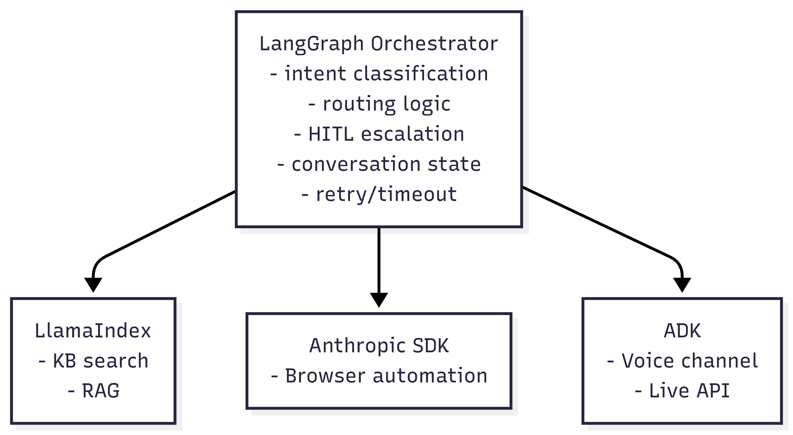

# AI Orchestration Frameworks

| Framework | Core Idea | Strength | Best Use Case |
|----------|----------|----------|--------------|
| LangGraph | Stateful graph (StateGraph), node = agent/task, explicit control flow | Kiểm soát flow cực chi tiết, state minh bạch, checkpoint/persistence, hỗ trợ loop/retry & human-in-the-loop, debug tốt | Workflow phức tạp, cần reliability cao, production system |
| Microsoft Agent Framework   (AutoGen + Semantic Kernel) | Multi-agent distributed system (actor model) + enterprise integration | Agent giao tiếp qua conversation (AutoGen), planning + memory + plugin (Semantic Kernel), async & distributed, phù hợp enterprise | Hệ multi-agent lớn, enterprise (Azure/.NET), cần scale & integration |
| CrewAI | Role-based collaboration (agent như team member với role/goal/backstory) | Dễ dùng, build nhanh, hỗ trợ workflow tuần tự & phân cấp, có sẵn tool (web/API/file) | Prototype nhanh, demo, business workflow đơn giản |
| Pydantic AI | Type-safe agent system (data validation-first) | Validate input/output chặt, giảm lỗi runtime, hỗ trợ MCP/A2A, durable execution, observability | System cần reliability cao, strict schema, production backend |
| Anthropic Agent SDK | Managed agent runtime (Claude-native) | Computer use, sandboxing, session persistence, infra managed hoàn toàn | Automation agent dùng Claude, không muốn tự quản infra |
| Google ADK | Cloud-native agent framework (Vertex AI + multimodal + A2A) | Tích hợp Gemini, hỗ trợ multimodal (text/image/audio/video), observability mạnh, scale tốt trong Google Cloud | Enterprise system trên Google Cloud, multimodal AI |
| LlamaIndex Workflows | Event-driven agent system + data-centric (RAG-first) | Kết nối data mạnh (DB, docs), event-based async flow, parallel execution, retry, observability reasoning | RAG system phức tạp, knowledge assistant, data-heavy AI |

# Đề xuất Framework 
---

- Qua quá trình nghiên cứu và so sánh các framework điều phối Agent, em đã rút ra một số đề xuất cốt lõi cho từng
    hướng tiếp cận như sau:

## 1. Nếu ưu tiên tính ổn định, quy trình phức tạp và chất lượng Code
- Lựa chọn: LangGraph kết hợp Pydantic AI
- Lý do: Em nhận thấy đây là "cặp bài trùng" hoàn hảo cho các hệ thống production cần độ tin cậy cao. LangGraph giúp
    em kiểm soát tuyệt đối luồng trạng thái (State Management) thông qua sơ đồ Graph minh bạch và hỗ trợ
    Human-in-the-loop cực tốt. Khi em kết hợp thêm Pydantic AI để tận dụng khả năng validate dữ liệu (Type-safe) chặt
    chẽ cho LLM, hệ thống sẽ giảm thiểu tối đa lỗi runtime, giúp code sạch và dễ bảo trì hơn rất nhiều.

## 2. Nếu bài toán tập trung sâu vào dữ liệu (Advanced RAG & Knowledge Assistant)
- Lựa chọn: LlamaIndex Workflows
- Lý do: Đối với các hệ thống cần xử lý khối lượng tài liệu khổng lồ của doanh nghiệp, em đánh giá LlamaIndex là
    không có đối thủ.
    - Em đặc biệt ấn tượng với cơ chế Event-driven (hướng sự kiện), cho phép xây dựng các luồng xử lý không đồng bộ
        (async flow) cực kỳ linh hoạt.
    - Khả năng xử lý song song (Parallel execution) giúp tăng tốc độ truy xuất dữ liệu từ nhiều nguồn (Vector DB,
        SQL, API) cùng lúc.
    - Hệ thống còn tích hợp sẵn khả năng quan sát (Observability) và đánh giá (Evaluation) chuyên sâu cho RAG, giúp
        em kiểm soát được độ chính xác của câu trả lời dựa trên dữ liệu thực tế thay vì chỉ dựa vào suy luận của model.

---

